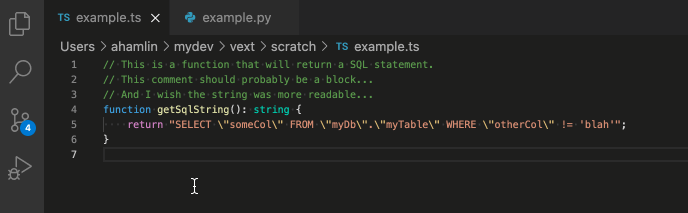
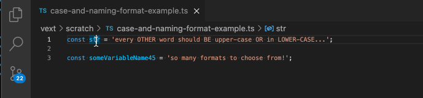

# Vext

Simple VS Code Extension to toggle text features! With `vext` you can:
- `Toggle Comment Type`: Toggle a selection between a block comment, a line comment, and uncommented text
- `Toggle Quote Characters`: Toggle a quoted string between using `"`, `'`, and ``` ` ```
- `Toggle Text Casing`: Toggle a selection or word between upper and lower case
- `Toggle Variable Naming Format`: Toggle a variable/identifier format between camel, snake, pascal, kebab, etc.





## Keybindings

Vext works best when you can quickly execute/re-execute these commands, so using keyboard shortcuts is recommended. Default command keybindings are listed below, but note that they may conflict with your existing keybindings.

* `Toggle Comment Type`: <kbd>Cmd</kbd>+<kbd>Opt</kbd>+<kbd>t</kbd> (_Mac_), <kbd>Ctrl</kbd>+<kbd>Alt</kbd>+<kbd>t</kbd> (_Other_)
* `Toggle Quote Characters`: <kbd>Cmd</kbd>+<kbd>Opt</kbd>+<kbd>'</kbd> (_Mac_), <kbd>Ctrl</kbd>+<kbd>Opt</kbd>+<kbd>'</kbd> (_Other_)
* `Toggle Text Casing`: <kbd>Cmd</kbd>+<kbd>Opt</kbd>+<kbd>a</kbd> (_Mac_), <kbd>Ctrl</kbd>+<kbd>Alt</kbd>+<kbd>a</kbd> (_Other_)
* `Toggle Variable Naming Format`: <kbd>Cmd</kbd>+<kbd>Opt</kbd>+<kbd>v</kbd> (_Mac_), <kbd>Ctrl</kbd>+<kbd>Alt</kbd>+<kbd>v</kbd> (_Other_)

## Dependencies

Optionally, you may configure `vext` to auto-format when toggling comment type (see "Extension Settings"). Requires the installation of the [Rewrap Extension](https://marketplace.visualstudio.com/items?itemName=stkb.rewrap).

## Extension Settings

This extension contributes the following settings:

* `vext.autoFormatOnToggleCommentType`: Enable/disable auto-format (using `Rewrap`) when toggling comment type. Defaults to false.
* `vext.quoteChars`: Quote characters to be used when toggling quotes. Defaults to ```[", ', `]```.
* `vext.caseExtraWordChars`: Additional characters that will be considered a part of `\w` when parsing words to toggle case. For example, if '-' is specified, then 'super-secret' would be considered a single word. Defaults to _most_ special characters.
* `vext.variableNamingFormats`: Variable naming formats to toggle between. Defaults to ```[camel, snake, snakeUpper, pascal, kebab]```, but `kebabUpper` is also available.

## Development

See `launch.json` for configurations to run the extension or to run the test suite.

## Future Work
- Support default quote characters by language
- Support quotes that use a different opening/closing characters

## Known Issues

None