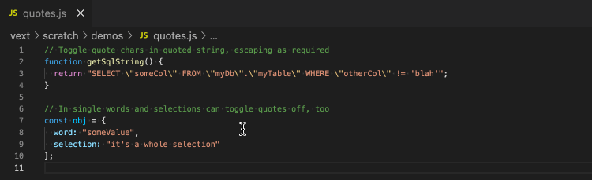
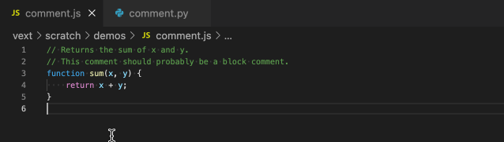
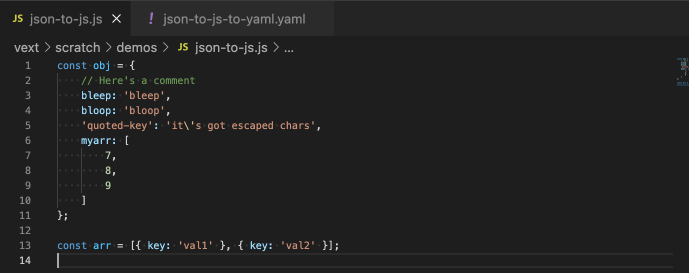
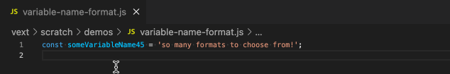
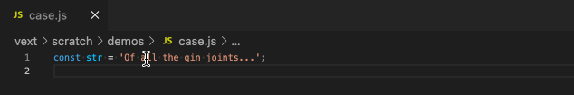

# Vext


Simple VS Code Extension to toggle text features! With `vext` commands you can...

***
- `Toggle Quote Characters`: Toggle outer quotes between `"`, `'`, and ``` ` ```

  
  - Keybinding: <kbd>Cmd</kbd>+<kbd>Opt</kbd>+<kbd>'</kbd> (_Mac_), <kbd>Ctrl</kbd>+<kbd>Alt</kbd>+<kbd>'</kbd> (_Other_)
  - Settings:
    - `vext.quoteChars`: Quote characters to be used when toggling quotes. Defaults to ```[", ', `]```.
***

- `Toggle Comment Type`: Toggle a selection between a block comment, a line comment, and uncommented text. It's language-aware!

  
  - Keybinding: <kbd>Cmd</kbd>+<kbd>Opt</kbd>+<kbd>t</kbd> (_Mac_), <kbd>Ctrl</kbd>+<kbd>Alt</kbd>+<kbd>t</kbd> (_Other_)
  - Settings:
    - `vext.autoFormatOnToggleCommentType`: When enabled, automatically format the selection when toggling comment type. Requires the [Rewrap Extension](https://marketplace.visualstudio.com/items?itemName=stkb.rewrap) to be installed. Defaults to false.
***

- `Toggle JSON to Javascript to YAML`: Toggle JSON object/array to "pretty" Javascript then to YAML and back.

  
  - Keybinding: <kbd>Cmd</kbd>+<kbd>Opt</kbd>+<kbd>j</kbd> (_Mac_), <kbd>Ctrl</kbd>+<kbd>Alt</kbd>+<kbd>j</kbd> (_Other_)
  - Settings:
    - `vext.useDoubleQuotesForOutputStrings`: When enabled, Javascript or YAML results will use double quotes (instead of single quotes) for string values and keys as required.
  - Notes:
    - YAML will NOT be output when:
      - it's a single-line selection
      - the first line (of a multi-line selection) is preceded by non-whitespace characters
***

- `Toggle Variable Naming Format`: Toggle a variable/identifier format between camel, snake, pascal, kebab, etc.

  
  - Keybinding: <kbd>Cmd</kbd>+<kbd>Opt</kbd>+<kbd>v</kbd> (_Mac_), <kbd>Ctrl</kbd>+<kbd>Alt</kbd>+<kbd>v</kbd> (_Other_)
  - Settings:
    - `vext.variableNamingFormats`: Variable naming formats to toggle between. Defaults to ```[camel, snake, snakeUpper, pascal, kebab]```, but `kebabUpper` is also available.
***

- `Toggle Text Casing`: Toggle a word or selection between upper and lower case

  
  - Keybinding: <kbd>Cmd</kbd>+<kbd>Opt</kbd>+<kbd>a</kbd> (_Mac_), <kbd>Ctrl</kbd>+<kbd>Alt</kbd>+<kbd>a</kbd> (_Other_)
  - Settings:
    - `vext.caseExtraWordChars`: Additional characters that will be considered a part of `\w` when parsing words to toggle case. For example, if '-' is specified, then 'super-secret' would be considered a single word. Defaults to _most_ special characters.

## Keybindings

Vext works best when you can quickly execute/re-execute these commands, so using keyboard shortcuts is recommended. Default command keybindings are listed for each command, but note that they may conflict with your existing keybindings.

## Development

See `launch.json` for configurations to run the extension or to run the test suite.

## Future Work
- Support default quote characters by language
- Support quotes that use a different opening/closing characters

## Known Issues

None